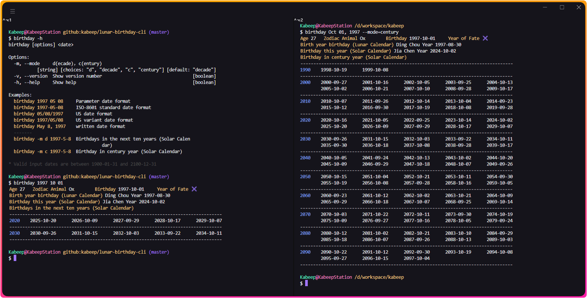

<div align="center">

<h1>lunar-birthday-cli</h1>

[![NodeJS][node-image]][node-url]
[![Install Size][install-size-image]][install-size-url]
[![XO code style][xo-code-style-image]][xo-code-style-url]
[![NPM][npm-image]][npm-url]
[![License][license-image]][license-url]

English | [简体中文][zh-cn-url]



</div>

## 📖 Introduction

A Node.js Library to list the lunar birthday in terminal.

## ⚙️ Installation

```bash
npm install --global @kabeep/lunar-birthday-cli
```

```bash
yarn add --global @kabeep/lunar-birthday-cli
```

```bash
pnpm add --global @kabeep/lunar-birthday-cli
```

## 🚀 Usage

```
birthday [options] <date>

Options:
  -m, --mode     e(gg), n(ow), d(ecade)，c(entury)
                           [string] [choices: "e", "n", "d", "c"] [default: "e"]
  -v, --version  Show version number                                   [boolean]
  -h, --help     Show help                                             [boolean]

Examples:
  birthday 1997 05 08     Parameter date format
  birthday 1997-05-08     ISO-8601 standard date format
  birthday 05/08/1997     US date format
  birthday 1997/05/08     US variant date format
  birthday May 8, 1997    written date format
  -------
  birthday 1997-5-8       Birth year birthday (Lunar Calendar)
  birthday -m n 1997-5-8  Birthday this year (Gregorian Calendar)
  birthday -m d 1997-5-8  Birthdays in the next ten years (Gregorian Calendar)
  birthday -m c 1997-5-8  Birthday in century year (Gregorian Calendar)

* Valid input dates are between 1900-01-31 and 2100-12-31
```

## 🌐 i18n

| 语言名称                |     本地名称      | ISO-639-1 | ISO-3166-1 (Alpha-2) | 文件                           |
|:--------------------|:-------------:|:---------:|:--------------------:|:-----------------------------|
| English             |       -       |    en     |          US          | [en-US.ts][locale-en-us-url] |
| Japanese            |      日本語      |    ja     |          JP          | [ja-JP.ts][locale-ja-jp-url] |
| Korean              |      한국어      |    ko     |          KR          | [ko-KR.ts][locale-ko-kr-url] |
| Malay               | Bahasa Melayu |    ms     |          MY          | [ms-MY.ts][locale-ms-my-url] |
| Vietnamese          |  Tiếng Việt   |    vi     |          VN          | [vi-VN.ts][locale-vi-vn-url] |
| Chinese Simplified  |     简体中文      |    zh     |          CN          | [zh-CN.ts][locale-zh-cn-url] |
| Chinese Traditional |     繁體中文      |    zh     |          TW          | [zh-TW.ts][locale-zh-tw-url] |

## 🔗 Related

- [lunar-date-fns][lunar-date-fns-url] - 🗓️ A JavaScript lunar date utility library.

## 🤝 Contribution

Contributions via Pull Requests or [Issues][issues-url] are welcome.

## 📄 License

This project is licensed under the MIT License. See the [LICENSE][license-url] file for details.


[node-image]: https://img.shields.io/node/v/%40kabeep%2Flunar-birthday-cli?color=lightseagreen
[node-url]: https://nodejs.org/

[npm-image]: https://img.shields.io/npm/d18m/%40kabeep%2Flunar-birthday-cli?color=cornflowerblue
[npm-url]: https://www.npmjs.com/package/@kabeep/lunar-birthday-cli

[install-size-image]: https://packagephobia.com/badge?p=@kabeep/lunar-birthday-cli
[install-size-url]: https://packagephobia.com/result?p=@kabeep/lunar-birthday-cli

[xo-code-style-image]: https://shields.io/badge/code_style-5ed9c7?logo=xo&labelColor=gray&logoSize=auto&logoWidth=20
[xo-code-style-url]: https://github.com/xojs/xo

[license-image]: https://img.shields.io/github/license/kabeep/lunar-birthday-cli?color=slateblue
[license-url]: LICENSE

[en-us-url]: README.md
[zh-cn-url]: README.zh-CN.md

[locale-en-us-url]: src/locale/en-US.ts
[locale-ja-jp-url]: src/locale/ja-JP.ts
[locale-ko-kr-url]: src/locale/ko-KR.ts
[locale-ms-my-url]: src/locale/ms-MY.ts
[locale-vi-vn-url]: src/locale/vi-VN.ts
[locale-zh-cn-url]: src/locale/zh-CN.ts
[locale-zh-tw-url]: src/locale/zh-TW.ts

[lunar-date-fns-url]: https://github.com/kabeep/lunar-date-fns

[issues-url]: https://github.com/kabeep/lunar-birthday-cli/issues
