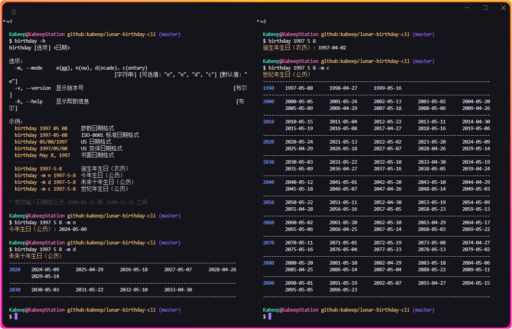

<div align="center">

<h1>lunar-birthday-cli</h1>

[![NodeJS][node-image]][node-url]
[![Install Size][install-size-image]][install-size-url]
[![NPM][npm-image]][npm-url]
[![XO code style][xo-code-style-image]][xo-code-style-url]
[![License][license-image]][license-url]

[English][en-us-url] | 简体中文

![Insights][insights-image]



</div>

## 📖 简介

在终端中列出农历诞辰的 Node.js 库。

## ⚙️ 安装

```bash
npm install @kabeep/lunar-birthday-cli --save
```

```bash
yarn add @kabeep/lunar-birthday-cli
```

```bash
pnpm add @kabeep/lunar-birthday-cli
```

## 🚀 使用

```
birthday [选项] <日期>

选项：
  -m, --mode     e(gg), n(ow), d(ecade)，c(entury)
                                      [字符串] [可选值: "e", "n", "d", "c"] [默认值: "e"]
  -v, --version  显示版本号                                                      [布尔]
  -h, --help     显示帮助信息                                                     [布尔]

示例：
  birthday 1997 05 08     参数日期格式
  birthday 1997-05-08     ISO-8601 标准日期格式
  birthday 05/08/1997     US 日期格式
  birthday 1997/05/08     US 变体日期格式
  birthday May 8, 1997    书面日期格式
  -------
  birthday 1997-5-8       诞生年生日（农历）
  birthday -m n 1997-5-8  今年生日（公历）
  birthday -m d 1997-5-8  未来十年生日（公历）
  birthday -m c 1997-5-8  世纪年生日（公历）

* 有效输入日期在公历 1900-01-31 到 2100-12-31 之间
```

## 🌐 国际化

| 语言名称                |     本地名称      | ISO-639-1 | ISO-3166-1 (Alpha-2) | 文件                           |
|:--------------------|:-------------:|:---------:|:--------------------:|:-----------------------------|
| English             |       -       |    en     |          US          | [en-US.ts][locale-en-us-url] |
| Japanese            |      日本語      |    ja     |          JP          | [ja-JP.ts][locale-ja-jp-url] |
| Korean              |      한국어      |    ko     |          KR          | [ko-KR.ts][locale-ko-kr-url] |
| Vietnamese          |  Tiếng Việt   |    vi     |          VN          | [vi-VN.ts][locale-vi-vn-url] |
| Chinese Simplified  |     简体中文      |    zh     |          CN          | [zh-CN.ts][locale-zh-cn-url] |
| Chinese Traditional |     繁體中文      |    zh     |          TW          | [zh-TW.ts][locale-zh-tw-url] |

## 🔗 关联库

- [lunar-date-fns][lunar-date-fns-url] - 🗓️ 一个 JavaScript 农历日期的实用程序库。

## 🤝 贡献

欢迎通过 Pull Requests 或 [Issues][issues-url] 来贡献你的想法和代码。

## 📄 许可

本项目采用 MIT 许可证。详情请见 [LICENSE][license-url] 文件。

[insights-image]: https://repobeats.axiom.co/api/embed/e4a09620c99c8d950ca56671c3d1e736e835461f.svg

[node-image]: https://img.shields.io/node/v/%40kabeep%2Flunar-birthday-cli?color=lightseagreen
[node-url]: https://nodejs.org/

[npm-image]: https://img.shields.io/npm/d18m/%40kabeep%2Flunar-birthday-cli?color=cornflowerblue
[npm-url]: https://www.npmjs.com/package/@kabeep/lunar-birthday-cli

[install-size-image]: https://packagephobia.com/badge?p=@kabeep/lunar-birthday-cli
[install-size-url]: https://packagephobia.com/result?p=@kabeep/lunar-birthday-cli

[xo-code-style-image]: https://shields.io/badge/code_style-5ed9c7?logo=xo&labelColor=gray&logoSize=auto&logoWidth=20
[xo-code-style-url]: https://github.com/xojs/xo

[license-image]: https://img.shields.io/github/license/kabeep/lunar-birthday-cli?color=slateblue
[license-url]: LICENSE

[en-us-url]: README.md
[zh-cn-url]: README.zh-CN.md

[locale-en-us-url]: src/locale/en-US.ts
[locale-ja-jp-url]: src/locale/ja-JP.ts
[locale-ko-kr-url]: src/locale/ko-KR.ts
[locale-vi-vn-url]: src/locale/vi-VN.ts
[locale-zh-cn-url]: src/locale/zh-CN.ts
[locale-zh-tw-url]: src/locale/zh-TW.ts

[lunar-date-fns-url]: https://github.com/kabeep/lunar-date-fns

[issues-url]: https://github.com/kabeep/lunar-birthday-cli/issues
